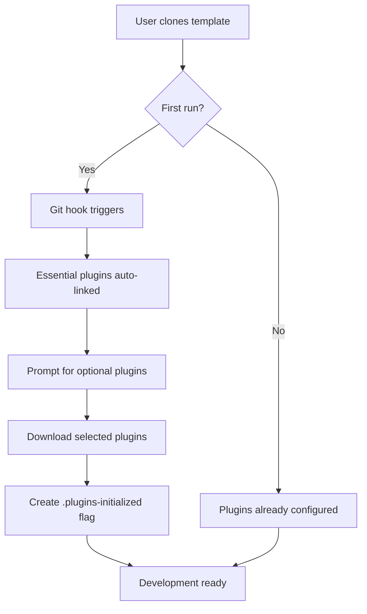

# Plugin Bundling Architecture for Claude Code Project Template

**Decision Date:** 2025-11-23
**Status:** Proposed
**Author:** @vidya-2.0 (Solution Architect)

## Executive Summary

This document outlines the architecture for bundling official Claude Code plugins within the template repository, enabling automatic plugin availability for new projects based on this template.

## Problem Statement

- Current plugins are installed globally at `~/.claude/plugins/` (288MB total)
- New projects from this template should have immediate access to official plugins
- Need balance between convenience, repo size, and maintainability

## Architecture Decision

### Recommended Approach: Hybrid Strategy

**Primary:** Lightweight manifest with automated installation
**Secondary:** Critical plugins bundled directly

## Detailed Architecture

### 1. Directory Structure

```
claude-code-project-template/
├── .claude/
│   ├── plugins/
│   │   ├── manifest.json         # Plugin registry and versions
│   │   ├── essential/            # Bundled critical plugins (<5MB)
│   │   │   ├── frontend-design/
│   │   │   └── code-review/
│   │   └── available/            # Plugin descriptions only
│   │       └── *.json            # Metadata for installable plugins
│   ├── scripts/
│   │   ├── install-plugins.sh    # Plugin installation script
│   │   └── update-plugins.sh     # Plugin update mechanism
│   └── hooks/
│       └── post-clone.sh          # Auto-run after clone
```

### 2. Plugin Categories

#### Essential Plugins (Bundled)
These are lightweight (<1MB each) and critical for development:
- `frontend-design` - Required by @hitesh-2.0 and @anand-2.0
- `code-review` - Required by @ankur-2.0
- `commit-commands` - Core git workflow

**Total Size:** ~3-5MB

#### On-Demand Plugins (Downloaded)
Larger or specialized plugins:
- `agent-sdk-dev` - Agent development toolkit
- `pr-review-toolkit` - Advanced PR features
- `security-guidance` - Security scanning
- Output style plugins - User preference

### 3. Implementation Components

#### A. Plugin Manifest (`manifest.json`)

```json
{
  "version": "1.0.0",
  "lastUpdated": "2025-11-23",
  "source": "https://github.com/anthropics/claude-code-plugins",
  "plugins": {
    "essential": [
      {
        "name": "frontend-design",
        "version": "1.2.0",
        "bundled": true,
        "required_by": ["@hitesh-2.0", "@anand-2.0"],
        "size": "1.2MB"
      },
      {
        "name": "code-review",
        "version": "2.1.0",
        "bundled": true,
        "required_by": ["@ankur-2.0"],
        "size": "0.8MB"
      }
    ],
    "available": [
      {
        "name": "agent-sdk-dev",
        "version": "3.0.1",
        "bundled": false,
        "download_url": "https://plugins.claude.code/agent-sdk-dev-3.0.1.tar.gz",
        "size": "45MB",
        "description": "SDK for developing custom agents"
      }
    ]
  }
}
```

#### B. Installation Script

```bash
#!/bin/bash
# .claude/scripts/install-plugins.sh

set -e

PLUGIN_DIR=".claude/plugins"
MANIFEST="$PLUGIN_DIR/manifest.json"
TARGET_DIR="$HOME/.claude/plugins/marketplaces/claude-code-plugins/plugins"

echo "🔌 Claude Code Plugin Setup"
echo "=========================="

# Step 1: Verify essential plugins
echo "✓ Verifying essential plugins..."
for plugin in $(jq -r '.plugins.essential[].name' "$MANIFEST"); do
    if [ -d "$PLUGIN_DIR/essential/$plugin" ]; then
        echo "  ✓ $plugin (bundled)"
        # Symlink to global location
        ln -sf "$PWD/$PLUGIN_DIR/essential/$plugin" "$TARGET_DIR/$plugin"
    fi
done

# Step 2: Prompt for optional plugins
echo ""
echo "📦 Available optional plugins:"
jq -r '.plugins.available[] | "  - \(.name) (\(.size)) - \(.description)"' "$MANIFEST"

read -p "Install all optional plugins? (y/n): " install_all
if [ "$install_all" = "y" ]; then
    # Download and install logic
    for plugin_url in $(jq -r '.plugins.available[].download_url' "$MANIFEST"); do
        wget -q "$plugin_url" -P /tmp/
        tar -xzf /tmp/$(basename "$plugin_url") -C "$TARGET_DIR/"
    done
fi

echo "✅ Plugin setup complete!"
```

#### C. Git Hook Integration

```bash
#!/bin/bash
# .claude/hooks/post-clone.sh

# Auto-run plugin setup after clone
if [ ! -f ".claude/.plugins-initialized" ]; then
    echo "🎉 Welcome to Claude Code Project Template!"
    echo "Setting up plugins..."
    bash .claude/scripts/install-plugins.sh
    touch .claude/.plugins-initialized
fi
```

### 4. User Experience Flow



### 5. Update Mechanism

```bash
#!/bin/bash
# .claude/scripts/update-plugins.sh

# Check for plugin updates
REMOTE_MANIFEST="https://raw.githubusercontent.com/anthropics/claude-code-plugins/main/manifest.json"
LOCAL_MANIFEST=".claude/plugins/manifest.json"

echo "🔄 Checking for plugin updates..."
wget -q "$REMOTE_MANIFEST" -O /tmp/manifest-latest.json

# Compare versions
if ! diff -q "$LOCAL_MANIFEST" /tmp/manifest-latest.json > /dev/null; then
    echo "📦 Updates available!"
    # Show diff and prompt for update
    jq -r '.plugins | to_entries[] | .value[] | "\(.name): \(.version)"' /tmp/manifest-latest.json
    read -p "Update plugins? (y/n): " update
    if [ "$update" = "y" ]; then
        cp /tmp/manifest-latest.json "$LOCAL_MANIFEST"
        bash .claude/scripts/install-plugins.sh
    fi
else
    echo "✅ All plugins up to date!"
fi
```

## Trade-off Analysis

### Option 1: Full Bundling (Not Recommended)
**Pros:**
- Offline-ready
- Zero setup friction
- Guaranteed compatibility

**Cons:**
- 288MB repo size increase ❌
- Difficult to update
- Git clone very slow
- Storage inefficient

### Option 2: Hybrid Approach (Recommended) ✅
**Pros:**
- Small repo size (~5MB increase)
- Critical plugins available immediately
- Optional plugins on-demand
- Easy updates via manifest

**Cons:**
- Requires internet for full setup
- One-time setup step

### Option 3: Pure Download (Alternative)
**Pros:**
- Minimal repo size
- Always latest versions
- Clean separation

**Cons:**
- Requires internet always
- Setup friction
- Potential version conflicts

## Implementation Priority

### Phase 1: Core Infrastructure (Week 1)
1. Create plugin manifest structure
2. Bundle essential plugins (frontend-design, code-review, commit-commands)
3. Implement installation script
4. Add git hooks

### Phase 2: Automation (Week 2)
1. Update mechanism
2. CI/CD integration
3. Plugin validation tests
4. Documentation

### Phase 3: Enhancement (Week 3)
1. Plugin preference profiles
2. Custom plugin support
3. Version pinning
4. Offline fallbacks

## Security Considerations

1. **Integrity Verification:**
   - SHA256 checksums in manifest
   - GPG signature verification for downloads

2. **Sandboxing:**
   - Plugins run in restricted context
   - No file system access outside project

3. **Review Process:**
   - Only official plugins bundled
   - Community plugins require manual approval

## Performance Impact

- **Initial Clone:** +5MB (negligible)
- **First Setup:** 30-60 seconds (one-time)
- **Runtime:** No impact (plugins lazy-loaded)

## Backward Compatibility

- Existing global plugins remain functional
- Project plugins take precedence
- Graceful fallback to global if project plugin missing

## Success Metrics

1. **Setup Time:** < 60 seconds for full plugin setup
2. **Repo Size:** < 10MB increase from bundled plugins
3. **Update Frequency:** Monthly plugin updates
4. **Adoption Rate:** 90% of template users enable plugins

## Decision Rationale

The hybrid approach optimizes for:
1. **Developer Experience:** Essential tools immediately available
2. **Repository Efficiency:** Minimal size increase
3. **Flexibility:** Users choose what they need
4. **Maintainability:** Easy updates via manifest

## Risks and Mitigations

| Risk | Impact | Mitigation |
|------|--------|-----------|
| Download server unavailable | High | Cache plugins in multiple CDNs |
| Version conflicts | Medium | Pin versions in manifest |
| Large plugin growth | Low | Regular audit of bundled plugins |
| Security vulnerabilities | High | Automated security scanning |

## Conclusion

The hybrid bundling strategy provides the best balance of convenience, efficiency, and maintainability for the Claude Code Project Template. Essential plugins are bundled for immediate use, while optional plugins are downloaded on-demand.

## Next Steps

1. **Review:** Architecture review by @atharva-2.0
2. **Approve:** Sign-off from project owner
3. **Implement:** @anand-2.0 executes implementation
4. **Test:** @harshit-2.0 validates installation flow
5. **Deploy:** @shawar-2.0 updates template repository

---

**Document Version:** 1.0.0
**Last Updated:** 2025-11-23
**Review Cycle:** Quarterly