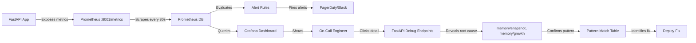

# Production Memory Observability Metrics Guide

## Quick Start: Install & Monitor

```bash
# 1. Add to requirements.txt
prometheus-client==0.19.0
psutil==5.9.6

# 2. In your FastAPI app
from fastapi_memory_monitor import setup_memory_monitoring

app = FastAPI()
setup_memory_monitoring(app)  # Enables all debug endpoints + Prometheus

# 3. Query metrics (available at :8001/metrics)
curl http://localhost:8001/metrics
```

---

## Critical Metrics for Memory Leak Detection

### 1. Primary Metric: RSS Growth Rate

**What it measures:** Resident Set Size increase over time
**Why it matters:** Only reliable indicator of actual memory consumption
**Query (Prometheus):**

```prometheus
# Detect monotonic growth >50MB/hour
rate(process_rss_bytes[1h]) > 52428800

# Detect spikes (>100MB in 5 min)
(process_rss_bytes - process_rss_bytes offset 5m) > 104857600

# Linear growth rate trend (>1MB/min sustained)
(process_rss_bytes - process_rss_bytes offset 30m) / 30 > 1048576
```

**Alert Rule:**

```yaml
- alert: MemoryLeakDetected
  expr: |
    (process_rss_bytes - process_rss_bytes offset 1h) > 104857600
  for: 10m
  labels:
    severity: critical
  annotations:
    summary: "Memory leak detected (>100MB growth in 1 hour)"
    description: "{{ $labels.instance }} RSS increased by >100MB"
```

### 2. Endpoint-Level Memory Delta

**What it measures:** Memory change caused by each request
**Why it matters:** Identifies which endpoints are leaking
**Query (Prometheus):**

```prometheus
# Find endpoints with highest memory impact
topk(10, rate(endpoint_memory_delta_bytes_sum[5m]))

# Endpoints consistently growing memory
rate(endpoint_memory_delta_bytes_bucket[5m]{le="+Inf"}) > 1048576
```

**Alert Rule:**

```yaml
- alert: HighMemoryEndpoint
  expr: |
    histogram_quantile(0.95, rate(endpoint_memory_delta_bytes_bucket[5m]))
    > 10485760  # 10MB per request
  for: 5m
  labels:
    severity: warning
  annotations:
    summary: "Endpoint {{ $labels.endpoint }} uses high memory"
```

### 3. Garbage Collection Metrics

**What it measures:** GC pause time and frequency
**Why it matters:** Slow GC = too many objects = likely leak
**Query (Prometheus):**

```prometheus
# Detect GC slowdown (collections taking >500ms)
rate(gc_duration_ms_bucket{le="500"}[5m]) <
rate(gc_duration_ms_bucket{le="+Inf"}[5m])

# Increasing GC frequency (more collections = more pressure)
rate(gc_collections_total[5m])
```

**Alert Rule:**

```yaml
- alert: GCSlowdown
  expr: histogram_quantile(0.95, gc_duration_ms) > 500
  for: 5m
  annotations:
    summary: "GC is slow (p95 > 500ms). Check for memory leak."
```

### 4. Object Growth Signals

**What it measures:** Types of objects accumulating
**Why it matters:** Points directly to leak source (e.g., dict growing)
**Integration:**

```python
# Hit this endpoint periodically to check object growth
GET /api/debug/memory/growth

# Response shows top growing types:
# {
#   "most_common_types": [
#     {"type": "dict", "count": 45678},     <-- Growing?
#     {"type": "list", "count": 12345},
#   ]
# }
```

---

## Monitoring Setup Examples

### Prometheus Configuration

```yaml
# prometheus.yml
global:
  scrape_interval: 30s
  evaluation_interval: 15s

scrape_configs:
  - job_name: 'fastapi-app'
    static_configs:
      - targets: ['localhost:8001']
    metrics_path: '/metrics'
```

### Docker Compose for Full Stack

```yaml
version: '3.8'
services:
  app:
    build: .
    ports:
      - "8000:8000"
      - "8001:8001"  # Prometheus metrics
    environment:
      - PYTHONUNBUFFERED=1

  prometheus:
    image: prom/prometheus:latest
    ports:
      - "9090:9090"
    volumes:
      - ./prometheus.yml:/etc/prometheus/prometheus.yml
    command:
      - '--config.file=/etc/prometheus/prometheus.yml'

  grafana:
    image: grafana/grafana:latest
    ports:
      - "3000:3000"
    environment:
      - GF_SECURITY_ADMIN_PASSWORD=admin
    depends_on:
      - prometheus
```

### Kubernetes Deployment

```yaml
apiVersion: v1
kind: Service
metadata:
  name: app-metrics
spec:
  ports:
    - name: metrics
      port: 8001
      targetPort: 8001
  selector:
    app: fastapi-app

---
apiVersion: monitoring.coreos.com/v1
kind: ServiceMonitor
metadata:
  name: app-memory
spec:
  selector:
    matchLabels:
      app: fastapi-app
  endpoints:
    - port: metrics
      interval: 30s
      path: /metrics
```

---

## Real-Time Monitoring Queries

### Grafana Dashboard Panels

**Panel 1: RSS Timeline**
```prometheus
process_rss_bytes / (1024*1024)
Legend: "{{instance}}"
```

**Panel 2: Memory Growth Rate (MB/minute)**
```prometheus
rate(process_rss_bytes[5m]) / (1024*1024) * 60
Legend: "Growth Rate {{instance}}"
```

**Panel 3: GC Pause Time (p95)**
```prometheus
histogram_quantile(0.95, gc_duration_ms)
Legend: "Gen {{generation}}"
```

**Panel 4: Top Memory Endpoints**
```prometheus
topk(5, rate(endpoint_memory_delta_bytes_sum[5m]) / (1024*1024))
Legend: "{{endpoint}} {{method}}"
```

**Panel 5: Object Count Trend**
```prometheus
# Custom metric (requires instrumentation)
python_objects_total
Legend: "{{type}}"
```

---

## Correlation Analysis: Link Errors to Memory

### Pattern: Memory Spike → Timeout → OOM Kill

```python
# Regex to correlate in logs
CORRELATED_PATTERN = r'(RSS:\s*(\d+)MB).*?(TIMEOUT|ERROR|exception).*?(killed|OOM)'

def find_memory_error_chains(log_content: str):
    """
    Find patterns: memory spike → error occurrence
    Indicates: memory leak causing functional failures
    """
    import re

    rss_events = re.finditer(r'([\d\-:T.]+).*?RSS:\s*(\d+)MB', log_content)
    error_events = re.finditer(r'([\d\-:T.]+).*?(ERROR|TIMEOUT|EXCEPTION)', log_content)

    correlations = []

    for error in error_events:
        error_time = error.group(1)
        error_type = error.group(2)

        # Look back 5 min for memory spike
        for rss in rss_events:
            rss_time = rss.group(1)
            rss_mb = int(rss.group(2))

            # If memory was high before error
            if rss_time < error_time and rss_mb > 800:
                correlations.append({
                    'memory_mb': rss_mb,
                    'memory_time': rss_time,
                    'error_type': error_type,
                    'error_time': error_time,
                    'correlation': 'LIKELY'
                })

    return correlations
```

---

## Memory Alerting Strategy

### Alert Thresholds (Tuned for Typical FastAPI)

| Metric | Threshold | Duration | Severity | Action |
|--------|-----------|----------|----------|--------|
| RSS growth rate | >5 MB/min | 10 min | HIGH | Page on-call |
| RSS absolute | >90% of limit | 5 min | CRITICAL | Auto-restart or page |
| GC pause time p95 | >500 ms | 5 min | MEDIUM | Investigate leak patterns |
| Memory delta per req | >10 MB | 10 requests | MEDIUM | Flag endpoint |
| Monotonic growth | 100% for 30 min | 30 min | HIGH | Page on-call |

### Tiered Alert Implementation

```python
# alerts.yaml
groups:
  - name: memory_leaks
    rules:
      # Tier 1: Imminent OOM (AUTO-RESTART)
      - alert: CriticalMemoryUsage
        expr: process_rss_bytes > 900*1024*1024  # 900MB limit
        for: 2m
        annotations:
          severity: critical
          action: "IMMEDIATE RESTART REQUIRED"

      # Tier 2: Rapid growth (PAGE ONCALL)
      - alert: RapidMemoryGrowth
        expr: rate(process_rss_bytes[5m]) > 5*1024*1024  # >5MB/min
        for: 10m
        annotations:
          severity: high
          action: "Page on-call, deploy patch"

      # Tier 3: Anomaly detection (INVESTIGATION)
      - alert: AnomalousMemoryPattern
        expr: |
          (process_rss_bytes - process_rss_bytes offset 1h) / 3600 > 2*1024*1024
        for: 30m
        annotations:
          severity: medium
          action: "Investigate in next sprint"
```

---

## Querying Memory Metrics: Examples

### Find All Instances with Leaks

```bash
curl 'http://prometheus:9090/api/v1/query?query=rate(process_rss_bytes%5B1h%5D)%20%3E%201048576' | jq
```

### Export Memory Timeline

```bash
curl 'http://prometheus:9090/api/v1/query_range?query=process_rss_bytes&start=2025-11-24T00:00:00Z&end=2025-11-25T00:00:00Z&step=60s' | jq
```

### Find Root Cause (Top Memory Endpoints)

```prometheus
# Show which endpoints consume memory
topk(10, sum(rate(endpoint_memory_delta_bytes_sum[5m])) by (endpoint))
```

---

## Troubleshooting Observability Issues

### Prometheus Metrics Not Appearing

```bash
# 1. Check app is exporting metrics
curl http://localhost:8001/metrics | head -20

# 2. Verify Prometheus can scrape
curl http://prometheus:9090/api/v1/targets

# 3. Check for metric name typos
# All custom metrics should start with: process_rss_bytes, endpoint_memory_delta_bytes, etc.
```

### High Cardinality Issues (Too Many Labels)

```python
# WRONG: Creates too many time series
endpoint_memory_delta.labels(
    endpoint=request.url.path,  # Includes query params → explosion
    method=request.method
).observe(delta)

# RIGHT: Only essential labels
endpoint_memory_delta.labels(
    endpoint=request.url.path.split('?')[0],  # No params
    method=request.method
).observe(delta)
```

---

## Dashboard Setup (Grafana)

### Import Premade Dashboard

1. Open Grafana: http://localhost:3000
2. Go to: Dashboards → New → Import
3. Use this JSON (create file: `memory-dashboard.json`):

```json
{
  "dashboard": {
    "title": "FastAPI Memory Leak Detection",
    "panels": [
      {
        "title": "RSS Growth Rate",
        "targets": [
          {
            "expr": "rate(process_rss_bytes[5m]) / (1024*1024) * 60"
          }
        ],
        "type": "graph"
      },
      {
        "title": "Total RSS",
        "targets": [
          {
            "expr": "process_rss_bytes / (1024*1024*1024)"
          }
        ],
        "type": "graph"
      },
      {
        "title": "GC Duration p95",
        "targets": [
          {
            "expr": "histogram_quantile(0.95, gc_duration_ms)"
          }
        ],
        "type": "graph"
      },
      {
        "title": "Top Memory Endpoints",
        "targets": [
          {
            "expr": "topk(5, rate(endpoint_memory_delta_bytes_sum[5m]) / (1024*1024))"
          }
        ],
        "type": "table"
      }
    ]
  }
}
```

---

## End-to-End Monitoring Workflow



---

## Integration Checklist

- [ ] Add `prometheus-client` to requirements.txt
- [ ] Call `setup_memory_monitoring(app)` in FastAPI startup
- [ ] Expose metrics endpoint `:8001/metrics`
- [ ] Configure Prometheus to scrape `:8001/metrics`
- [ ] Import Grafana dashboard JSON
- [ ] Create alert rules for high/critical thresholds
- [ ] Set up PagerDuty/Slack integration
- [ ] Load test and verify metrics are flowing
- [ ] Document runbook for on-call engineers

---

**Related Files:**
- `MEMORY_LEAK_DEBUGGING_GUIDE.md` - Detailed debugging workflow
- `memory_debug_toolkit.py` - CLI tools for detection
- `fastapi_memory_monitor.py` - Integration code + debug endpoints

**Reviewed:** 2025-11-24
